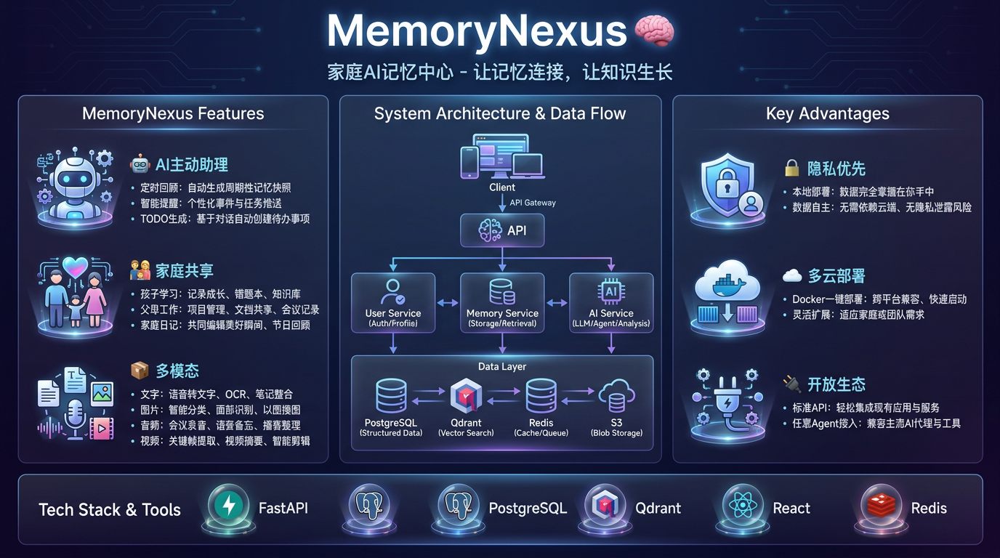
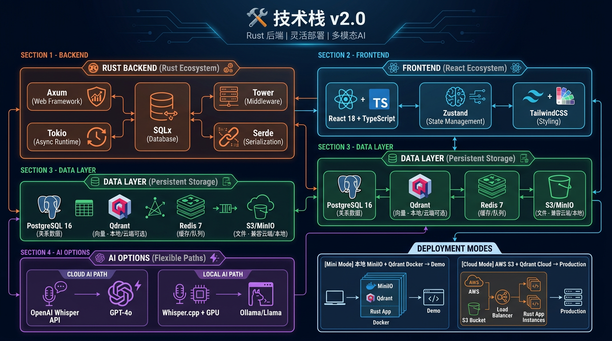
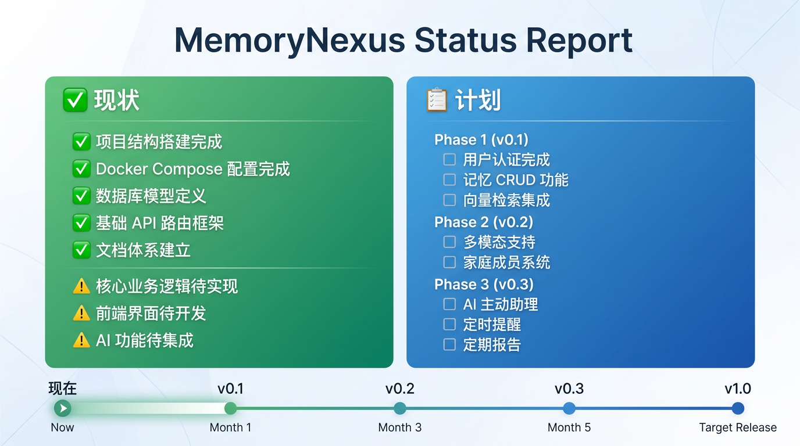
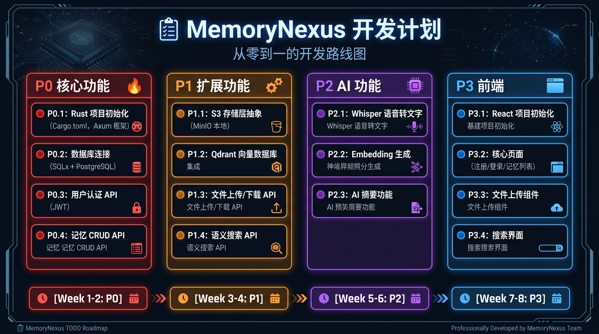
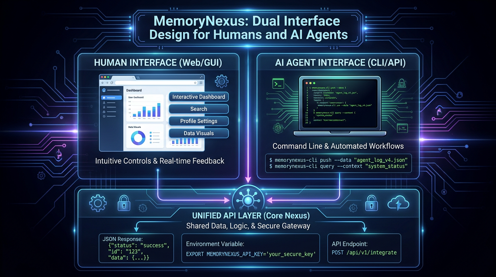
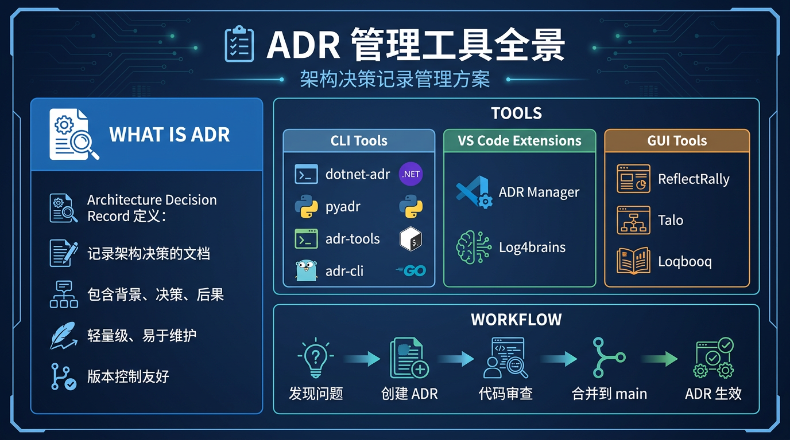

# 🎨 MemoryNexus 项目展示

> 一图胜千言 - 用可视化方式展示项目

---

## 📌 项目概览

---

## 🛠️ 技术栈

---

## 📋 项目状态

---

## 🎯 开发计划

---

## 💻 CLI 设计

---

## 📚 ADR 管理工具

---

## 🎥 视频演示

> TODO: 添加产品演示视频链接

---

## 📱 截图

> TODO: 添加实际界面截图

---
